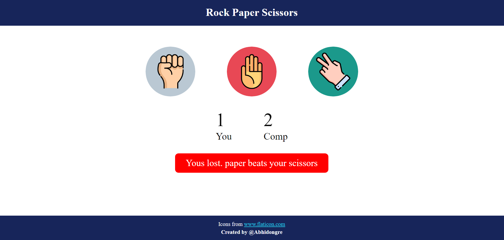

<h1 align="center">Rock Paper Scissors Game</h1>

  

  Welcome to the Rock Paper Scissors game! This project is a simple yet engaging implementation of the classic Rock Paper Scissors game using HTML, CSS, and JavaScript. It's a fun way to test your decision-making skills against the computer.

 

  <strong>Features:</strong>

- Play the classic Rock Paper Scissors game against the computer.
- Responsive design for an optimal gaming experience on various devices.
- Realistic icons for rock, paper, and scissors enhance the visual appeal.
- Keep track of your score against the computer.
- Interactive messages guide you through each game round.

 

  

 

  <strong>How to Play:</strong>

1. Open the [live demo](#) or clone this repository.
2. Launch the `index.html` file in your web browser.
3. Click on your chosen move (Rock, Paper, or Scissors).
4. See the computer's move and find out who wins the round!
5. The score will be updated, and you can play again for endless fun.

 

  <strong>Repository Structure:</strong>

- `index.html`: The main HTML file containing the game structure.
- `style.css`: The stylesheet for styling the game layout.
- `script.js`: The JavaScript file handling game logic and interactions.

 

  <strong>Acknowledgments:</strong>

- Icons sourced from [Flaticon](https://www.flaticon.com/).

 

  Have fun playing Rock Paper Scissors! 🎮✂️📜

